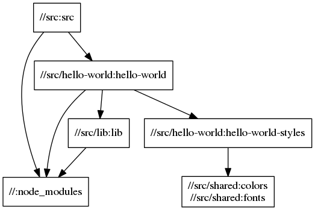

[](https://circleci.com/gh/alexeagle/angular-bazel-example)

# Example of building an Angular app with Bazel

**This is experimental! There may be breaking changes.**

This is part of the ABC project. See http://g.co/ng/abc for an overview.

See the documentation in the wiki of this repository to install the
necessary dependencies and understand how this works.

Follow https://github.com/angular/angular/issues/19058 for updates.

## Try it

```bash
# Install packages, uses hermetic version of node and yarn
$ bazel run @yarn//:yarn
# Start up the devserver in watch mode
$ ./node_modules/.bin/ibazel run :devserver
# Open the URL printed on your terminal.
# Make changes to sources, observe the development round-trip time
```

Look at the dependency graph:

```bash
$ bazel query --output=graph ... | dot -Tpng > graph.png
```




## Still missing

Karma testing rules are in-progress, should be available Q4 2017

Production bundling with https://github.com/bazelbuild/rules_closure/ is
underway, should be available Q4 2017

## Notes

- we use Bazel to run Yarn simply to be sure we get the same versions of Node and Yarn as CI and co-workers (hermeticity FTW). You could use NPM instead
- a `postinstall` task in the `package.json` prepares the `node_modules` directory by running the Angular compiler on third_party libraries (such as Angular itself) since these do not ship with generated code (eg. `ngfactory`s)
